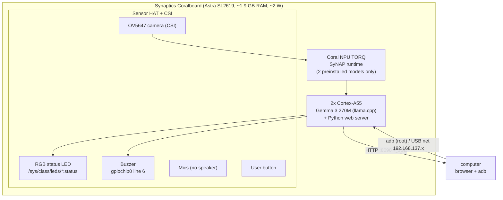
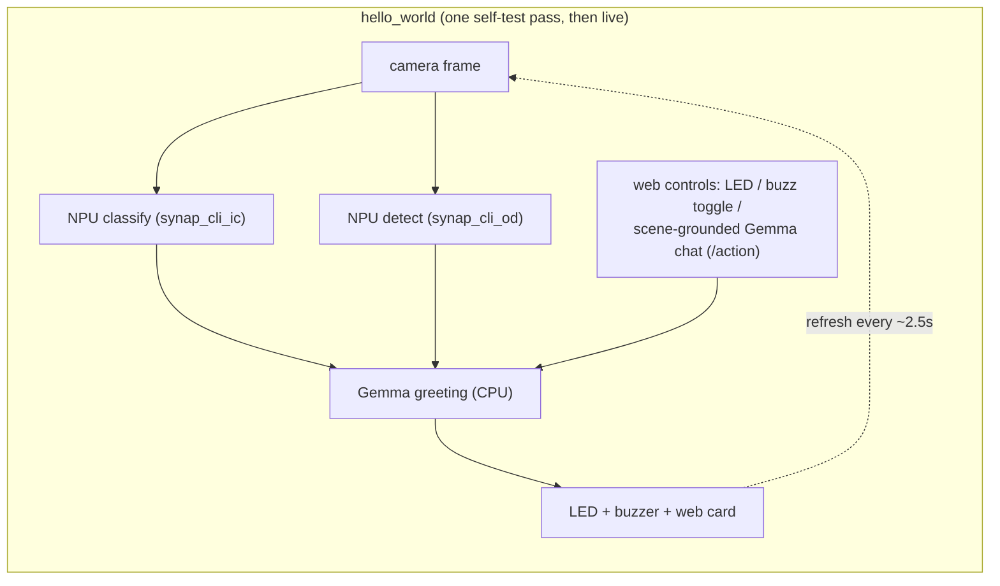
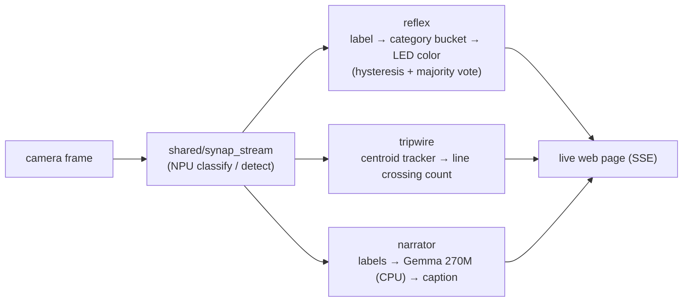

# coralboard-demos

Self-contained demos for the **Synaptics Coralboard** (Astra SL2619 + Coral NPU "TORQ"), built to
show what the board's NPU can do on-device, with nothing but the board, its Sensor HAT shield, and the
OV5647 camera. No cloud, no torch.

The demo runs on a laptop with `--mock` (so you can read the output and the web UI without the board),
and on the board for real. Vision runs on the NPU via the two preinstalled SyNAP models; Gemma 3 270M
runs on the CPU via llama.cpp.

| Demo | What it shows | Uses |
|------|---------------|------|
| [`hello_world/`](hello_world/) | The board's "hello world" / bring-up self-test: camera, NPU classify + detect, RGB LED, buzzer, and a Gemma greeting, all in one run. | camera + NPU (both models) + LED + buzzer + Gemma + web |
| [`reflex/`](reflex/) | **Reactive smart-camera.** Hold up an object → NPU classifies it in ~31 ms → the board reacts physically: the RGB LED changes color by category (food→green, animal→blue, vehicle→red, device→white, clothing→magenta, other→cyan) and the page shows the verdict + top-5 + live NPU latency. | camera + NPU classify + LED + web |
| [`tripwire/`](tripwire/) | **Live crossing counter.** Draw a line on the page; the NPU detects COCO objects each frame and a CPU centroid tracker counts each object that crosses, per direction. | camera + NPU detect + web |
| [`narrator/`](narrator/) | **Hybrid vision + LLM.** The NPU runs the vision continuously while Gemma 3 270M on the CPU narrates the scene in one plain sentence, refreshed every few seconds. | camera + NPU detect + Gemma + web |

`hello_world` is the bring-up self-test; **`reflex` + `tripwire`** are the pure-NPU-vision showcase pair and
**`narrator`** is the vision+LLM hybrid. The plan and per-demo design notes are in
[`docs/demos-plan.md`](docs/demos-plan.md).

See [`HARDWARE.md`](HARDWARE.md) for the verified board details (NPU models, LED/buzzer wiring, camera,
board access) needed to reproduce these.

## Architecture

### The board

The Astra **SL2619** runs everything on-device: vision on the Coral NPU, Gemma on the two A55 cores, and
the peripherals over the Sensor HAT. No Wi-Fi - you reach it over USB (adb + USB networking).



Hard constraint: the NPU runs **only the 2 preinstalled SyNAP models** (no SL2619 target in the toolkit),
so a demo's value comes from **speed + locality + combining the NPU with on-CPU Gemma**, not a custom model.

### The demo



`hello_world` exercises every subsystem once (bring-up self-test), then keeps the camera frame live and
exposes web controls (LED, buzzer, and an on-device **Gemma chat box**). It uses `shared/`
(camera, vision, Gemma client, LEDs/buzzer, web server, config).

### The showcase demos

The three showcase demos share one live-vision seam, `shared/synap_stream.py`: it grabs a frame and runs
NPU inference per loop, returning parsed results + the JPEG to show. Today it uses the proven per-frame
`synap_cli_*` shell-out (same path as `hello_world`); a resident-model GStreamer pipeline that keeps the
NPU model loaded (classify ~31 ms / detect ~271 ms) is scaffolded behind `CORAL_SYNAP_RESIDENT=1` and
falls back automatically until its caps are brought up on the board (see the module and `docs/demos-plan.md`).



- **`reflex`** debounces the chattering top-1 with a majority vote over N frames + a confidence floor to
  enter a new category (a dead band), so the LED only flips when a category is clearly, repeatedly winning.
  ImageNet→category mapping is a static keyword table in `shared/imagenet_buckets.py`.
- **`tripwire`** tracks centroids on the CPU between detections (`shared/tracker.py`) to assign stable IDs
  and detect line crossings. Keep the scene to a few well-separated subjects — an 80-class SSD undercounts
  dense/overlapping subjects.
- **`narrator`** runs vision and Gemma on separate threads; `run_board.sh` sets `CORAL_LLM_THREADS=1` for it
  so generating a caption leaves a core free for the vision loop. Caption cadence is a few seconds (270M on
  CPU ≈ 6.5 tok/s), not instant.

## Quickstart - laptop (mocked hardware, real models)

```bash
./models/fetch_models.sh                      # one-time: download the Gemma 3 270M GGUF (~291 MB)
./run_laptop.sh hello                          # then open http://localhost:8090
./run_laptop.sh reflex                         # or: reflex | tripwire | narrator
```

`run_laptop.sh` creates a `.venv` on first run. `--mock` fakes the camera/LED/buzzer and the NPU (it
cycles plausible labels/detections) but keeps **Gemma real** - the same GGUF that runs on the board.
`reflex` and `tripwire` are pure NPU vision (no model needed in mock); `narrator` and `hello` use Gemma
(add `--backend template` for a no-model run). Each demo serves its own page on the same port.

Or pick from a menu with `./demo.sh` (add `--board` to run on real hardware: `./demo.sh --board reflex`).

## First run: test hello_world over USB (real camera + real NPU)

Use this the first time you plug the board into your computer, to confirm the whole board works. Hardware
hookup (camera + Sensor HAT + USB) is in [`HARDWARE.md`](HARDWARE.md) → **Connecting the hardware**.

1. **Confirm the board is connected:**
   ```bash
   adb devices                 # expect:  grinn-astra-2619-coral   device
   ```
   If it's empty, see HARDWARE.md (replug, data cable, etc.).

2. **Copy the code to the board** (run from this repo on your computer):
   ```bash
   ./copy_to_board.sh          # git archive HEAD + adb push -> /home/root/coralboard-demos
   ```
   `copy_to_board.sh` ships `git archive HEAD`, so **commit first** or your edits won't go over.

3. **Set up + run on the board** (over adb):
   ```bash
   adb shell
   cd /home/root/coralboard-demos
   ./setup_board.sh            # one-time: venv + Gemma wheel + GGUF + NPU sanity check
   ./run_board.sh hello        # starts the demo; leave it running
   ```
   `setup_board.sh` needs internet for pip/the GGUF: from your computer, run `./net_board_internet.sh` once
   (it gives the board internet over USB), then re-run setup.

4. **Open the web page from your computer.** The board has no Wi-Fi, so forward the port over adb (in a
   second terminal on your computer):
   ```bash
   adb forward tcp:8090 tcp:8090
   ```
   Then open **http://localhost:8090**.

**What you should see**
- Console: one `[ok]`/`[!!]` line per subsystem (camera, NPU classify, NPU detect, Gemma), then a
  one-line greeting. Startup is **silent** (no beep).
- Web page: the live camera frame with green detection boxes, the detected scene/objects, the greeting,
  and the per-subsystem status list. The **RGB LED** turns green when the first pass finishes. The buzzer
  only sounds if you press the **Buzz** toggle yourself.
- A `[!!]` line means that one subsystem degraded (e.g. camera unplugged) — the demo keeps running and the
  line tells you what failed.

**Stop it cleanly:** `Ctrl-C` in the run shell. Never `kill -9` a `synap_cli_*` mid-inference (it wedges
the NPU). To redeploy code changes: `Ctrl-C`, `./copy_to_board.sh` (after committing), then `./run_board.sh hello` again.

Prefer to try it without the board first? `./run_laptop.sh hello` runs the same demo with mocked hardware
(real Gemma) — see the laptop quickstart above.

Once `hello` confirms the board, the showcase demos run the same way — swap the name:
`./run_board.sh reflex` (hold objects to the camera; watch the LED), `./run_board.sh tripwire` (draw the
line on the page; walk objects across it), `./run_board.sh narrator` (let it describe the scene). Same port
8090, same `adb forward`, same clean `Ctrl-C` to stop.

## Layout
```
shared/        camera, vision (NPU), synap_stream (live-vision seam), imagenet_buckets,
               tracker, Gemma client, LEDs/buzzer, web server, config
hello_world/   bring-up self-test (main.py + web/)
reflex/        reactive smart-camera (main.py + web/)
tripwire/      live crossing counter (main.py + web/)
narrator/      NPU vision + Gemma narration (main.py + web/)
models/        fetch_models.sh (Gemma GGUF; weights are not in git)
*.sh           run_laptop / run_board / setup_board / copy_to_board / net_board_internet
```

## Notes
- All vision is on the **NPU** (`synap_cli_ic` / `synap_cli_od`). No CPU fallback, no torch.
- The web server is stdlib only (`http.server` + SSE) - nothing to install on the board for the UI.
- Output, UI, and code are in English.
- **Buzzer (read this):** the buzzer is **active-low** (`gpiochip0` line 6: `0` sounds, `1` is silent) and
  this board **latches** the last written value. It **never sounds on its own** - there is no startup beep
  and nothing triggers it but the web **Buzz** button, which is a **toggle** (press to sound, press again to
  stop). A safety timer forces it off after `CORAL_BUZZER_MAX_SEC` (default 12 s), the demo silences it on
  exit, and `CORAL_BUZZER_ENABLE=0` hard-disables it. Panic-silence by hand: `gpioset gpiochip0 6=1`.
  Polarity overrides: `CORAL_BUZZER_ON` / `CORAL_BUZZER_IDLE`.
- **Camera:** the OV5647's exposure/gain/white-balance controls live on the **sensor subdev**
  (`/dev/v4l-subdev*`), *not* on `/dev/video0` (which only has `wb_enable`). The sensor powers up in manual
  mode at near-minimum gain - so it gives near-black frames, and lifting those in software amplifies the
  noise floor into coloured "static". The fix is in hardware: `shared/camera.py` switches the sensor to
  **auto exposure / auto gain / auto white-balance** on every stream start (via `v4l2-ctl` on the sensor
  subdev), then software adds only a gentle gamma. Result: bright, neutral, low-noise frames that adapt to
  the light. Tune: `CORAL_CAM_AE`/`AGC`/`AWB` (auto, default 1), `CORAL_CAM_GAIN`/`CORAL_CAM_EXPOSURE`
  (manual when auto off), `CORAL_CAM_GAMMA` (0.6), `CORAL_CAM_JPEG_Q` (92). The OV5647 is still a modest
  sensor (soft, noisy in true low light) but no longer broken.
- **Deploying changes:** `copy_to_board.sh` ships `git archive HEAD`, so **commit first** or your edits
  won't go over. A running demo holds the old code in memory - **restart it** (`Ctrl-C` then
  `./run_board.sh ...`) to pick up new code. To view the page without USB networking:
  `adb forward tcp:8090 tcp:8090` then open `http://localhost:8090`.
