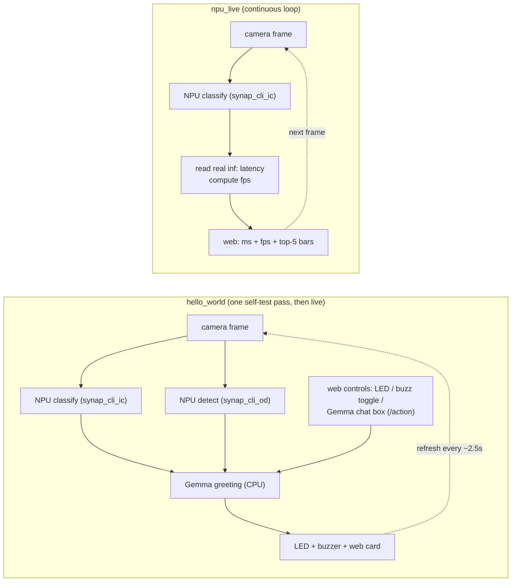

# coralboard-demos

Two self-contained demos for the **Synaptics Coralboard** (Astra SL2619 + Coral NPU "TORQ"), built to
show what the board's NPU can do on-device, with nothing but the board, its Sensor HAT shield, and the
OV5647 camera. No cloud, no torch.

Both demos run on a laptop with `--mock` (so you can read the output and the web UI without the board),
and on the board for real. Vision runs on the NPU via the two preinstalled SyNAP models; Gemma 3 270M
runs on the CPU via llama.cpp.

| Demo | What it shows | Uses |
|------|---------------|------|
| [`hello_world/`](hello_world/) | The board's "hello world" / bring-up self-test: camera, NPU classify + detect, RGB LED, buzzer, and a Gemma greeting, all in one run. | camera + NPU (both models) + LED + buzzer + Gemma + web |
| [`npu_live/`](npu_live/) | The NPU's speed, live: continuous classification with the real measured inference latency (ms), the achieved fps, and top-5 confidence bars that react as you move an object. | camera + NPU (classification) + web |

See [`HARDWARE.md`](HARDWARE.md) for the verified board details (NPU models, LED/buzzer wiring, camera,
board access) needed to reproduce these.

## Architecture

### The board

The Astra **SL2619** runs everything on-device: vision on the Coral NPU, Gemma on the two A55 cores, and
the peripherals over the Sensor HAT. No Wi-Fi - you reach it over USB (adb + USB networking).


Hard constraint: the NPU runs **only the 2 preinstalled SyNAP models** (no SL2619 target in the toolkit),
so a demo's value comes from **speed + locality + combining the NPU with on-CPU Gemma**, not a custom model.

### The demos



`hello_world` exercises every subsystem once (bring-up self-test), then keeps the camera frame live and
exposes web controls (LED, buzzer, and an on-device **Gemma chat box**). `npu_live` is a tight
classify-every-frame loop that surfaces the NPU's measured latency and fps. Both share `shared/`
(camera, vision, Gemma client, LEDs/buzzer, web server, config).

## Quickstart - laptop (mocked hardware, real models)

```bash
./models/fetch_models.sh        # one-time: download the Gemma 3 270M GGUF (~291 MB)
./run_laptop.sh hello           # then open http://localhost:8090
./run_laptop.sh npu             # then open http://localhost:8090
```

`run_laptop.sh` creates a `.venv` on first run. `--mock` fakes the camera/LED/buzzer and the NPU (it
cycles plausible labels) but keeps **Gemma real** - the same GGUF that runs on the board.

## Quickstart - board (real camera + real NPU)

```bash
./copy_to_board.sh              # git archive + adb push -> /home/root/coralboard-demos
# then, on the board (adb shell):
cd /home/root/coralboard-demos
./setup_board.sh                # venv + Gemma wheel + GGUF + NPU sanity check
./run_board.sh hello            # open http://<board-ip>:8090
./run_board.sh npu
```

The board has no Wi-Fi; reach the web page over USB networking. To give the board internet for setup,
run `./net_board_internet.sh` from the Mac (one command). Details in `HARDWARE.md`.

## Layout
```
shared/        camera, vision (NPU), Gemma client, LEDs/buzzer, web server, config
hello_world/   demo 1 (main.py + web/)
npu_live/      demo 2 (main.py + web/)
models/        fetch_models.sh (Gemma GGUF; weights are not in git)
*.sh           run_laptop / setup_board / copy_to_board / net_board_internet
```

## Notes
- All vision is on the **NPU** (`synap_cli_ic` / `synap_cli_od`). No CPU fallback, no torch.
- The web server is stdlib only (`http.server` + SSE) - nothing to install on the board for the UI.
- Output, UI, and code are in English.
- **Buzzer (read this):** the buzzer is **active-low** (`gpiochip0` line 6: `0` sounds, `1` is silent) and
  this board **latches** the last written value. It **never sounds on its own** - there is no startup beep
  and nothing triggers it but the web **Buzz** button, which is a **toggle** (press to sound, press again to
  stop). A safety timer forces it off after `CORAL_BUZZER_MAX_SEC` (default 12 s), the demo silences it on
  exit, and `CORAL_BUZZER_ENABLE=0` hard-disables it. Panic-silence by hand: `gpioset gpiochip0 6=1`.
  Polarity overrides: `CORAL_BUZZER_ON` / `CORAL_BUZZER_IDLE`.
- **Camera:** the OV5647 underexposes indoors and casts green. `shared/camera.py` lifts it in software
  (no v4l2 exposure control exists): gamma shadow-lift + gray-world white balance + black/white-point
  stretch + denoise. Tune with `CORAL_CAM_GAMMA` (0.50), `CORAL_CAM_BRIGHTEN` (1.3), `CORAL_CAM_WB` (1),
  `CORAL_CAM_CONTRAST` (2), `CORAL_CAM_DENOISE` (1). Quality is sensor-bound; this pass is the only lever.
- **Deploying changes:** `copy_to_board.sh` ships `git archive HEAD`, so **commit first** or your edits
  won't go over. A running demo holds the old code in memory - **restart it** (`Ctrl-C` then
  `./run_board.sh ...`) to pick up new code. To view the page without USB networking:
  `adb forward tcp:8090 tcp:8090` then open `http://localhost:8090`.
