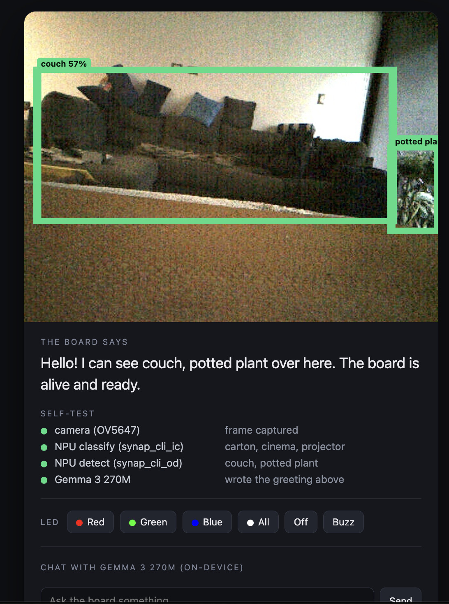

# hello_world

The Coralboard's "hello, world". The smallest demo that exercises every part of the board at once, so it
also works as a bring-up self-test: run it first to confirm your board is alive.



## What it does (one pass, then live)
1. **Camera** - capture a frame from the OV5647 (`shared/camera.py`, GStreamer).
2. **NPU classify** - `synap_cli_ic` (MobileNetV2 / ImageNet) names the scene (~33 ms inference).
3. **NPU detect** - `synap_cli_od` (COCO) finds objects + boxes.
4. **Gemma 3 270M** - writes a one-line greeting about what it saw (CPU, llama.cpp).
5. **Output** - sets the RGB status LED (blue while booting -> amber while thinking -> green when done)
   and pushes the frame + boxes + greeting + a per-subsystem status list to a local web page. The buzzer
   is **never** triggered automatically (it sits at your ears) - it only sounds from the web Buzz toggle.

After that first pass the camera **keeps refreshing live** (re-capture + re-classify every
`CORAL_REFRESH_SEC`, default 2.5s) so the page shows a live frame, not a frozen shot.

Each step is wrapped so a missing subsystem shows a clear status line instead of crashing.

The web page also has live controls:
- **RGB LED** buttons (Red / Green / Blue / All / Off) and a **Buzz** button - drive the peripherals by
  hand. They post to `GET /action` (`do=led&color=RRGGBB` or `do=buzz`). **Buzz is a toggle** (press to
  sound, press again to stop; the button shows "Buzz (on)" while sounding) with a safety auto-off.
- A **Gemma chat box** - chat with the on-device 270M (`do=chat&msg=...`); the reply comes back as JSON
  (emojis stripped; parroted replies are rejected and retried). The chat is **grounded in what the camera
  /NPU currently sees** (the live detections are injected into the prompt), so `What do you see?` answers
  concretely - the one thing a 270M does reliably. Open-domain chat just loops on a memorised line; that's
  the model size, not a bug.

All are handled in `main.py` via `webserver.set_action_handler` (the `/action` endpoint returns the
handler's dict, so a control can send data back, like the chat reply).

## Run
```bash
# Laptop (hardware mocked, Gemma real):
./run_laptop.sh hello                 # open http://localhost:8090

# Board (real hardware):
./run_board.sh hello                  # open http://<board-ip>:8090
./run_board.sh hello --image foo.jpg  # use a fixed JPEG instead of the camera
```

## What to expect
- Console: a `[ok]`/`[!!]` line per subsystem, then the greeting. **Startup is silent** (no beep).
- Web page: the captured frame with green detection boxes, the greeting, and the status list. On the
  board you should also see the RGB LED turn **green** at the end. The buzzer only sounds if you press
  the **Buzz** toggle yourself.

## Hardware used
Camera (OV5647), NPU (both preinstalled SyNAP models), RGB status LED (`/sys/class/leds/*:status`),
buzzer (`BUZZERn`, gpiochip0 line 6, **active-low** via `gpioset`; `0` sounds, `1` silent; the line
latches its last value), Gemma 3 270M on the A55 cores. See `../HARDWARE.md`.

## Relevant env vars
- `CORAL_LED_RED` / `CORAL_LED_GREEN` / `CORAL_LED_BLUE` - LED class names (defaults `*:status`).
- **Buzzer:** `CORAL_BUZZER_ENABLE` (default `1`; set `0` to hard-disable), `CORAL_BUZZER_ON` (value that
  sounds, default `0` = active-low), `CORAL_BUZZER_IDLE` (silent value, default `1`), `CORAL_BUZZER_MAX_SEC`
  (safety auto-off, default `12`), `CORAL_BUZZER_CHIP` / `CORAL_BUZZER_LINE` (default `gpiochip0` / `6`).
- `CORAL_WEB_PORT` - web port (default 8090).
- `CORAL_REFRESH_SEC` - live camera refresh interval after the first pass (default `2.5`).
- **Camera** - the real exposure controls are on the **sensor subdev** (not `/dev/video0`), so
  `shared/camera.py` puts the OV5647 into hardware auto-exposure / auto-gain / auto-white-balance on
  every stream start; software then only adds a gentle gamma. Sensor: `CORAL_CAM_AE` / `CORAL_CAM_AGC` /
  `CORAL_CAM_AWB` (auto exposure / gain / WB, default `1`), `CORAL_CAM_GAIN` (manual `analogue_gain`
  16-1023 when `AGC=0`), `CORAL_CAM_EXPOSURE` (manual when `AE=0`), `CORAL_CAM_SENSOR_SUBDEV` (override
  auto-detected subdev), `CORAL_CAM_WARMUP` (frames discarded while AE settles, default `30`). Software:
  `CORAL_CAM_GAMMA` (shadow lift, default `0.6`, lower = brighter; `>=1` off), `CORAL_CAM_BRIGHTEN`
  (extra gain, default `1.0`=off), `CORAL_CAM_WB` (software gray-world WB, default `0`), `CORAL_CAM_CONTRAST`
  (autocontrast cutoff %, default `0`=off), `CORAL_CAM_DENOISE` (default `0`), `CORAL_CAM_STACK`
  (frame-average N for a static dark scene, default `1`=off), `CORAL_CAM_JPEG_Q` (capture quality, `92`).
  Applied in `shared/camera.py`.
